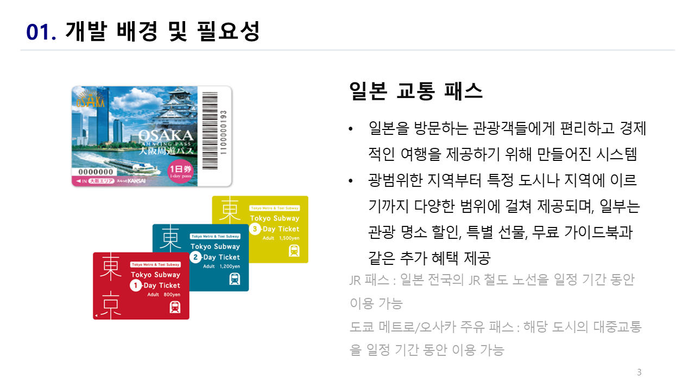
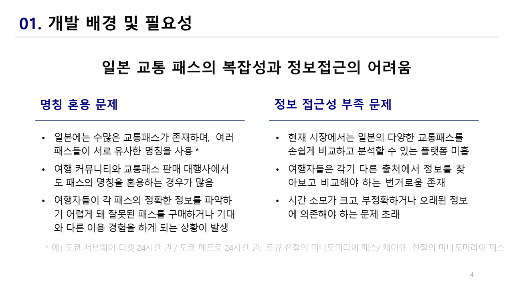
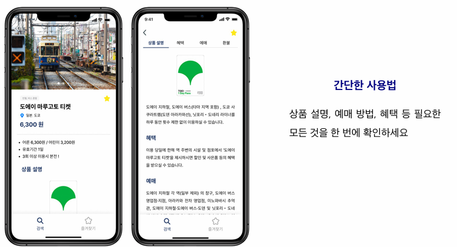
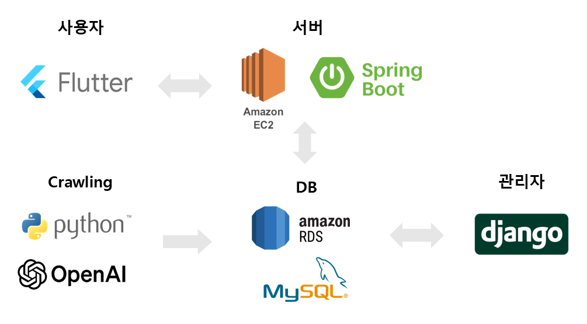
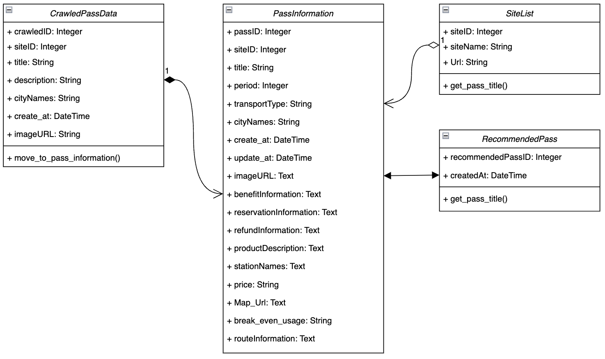
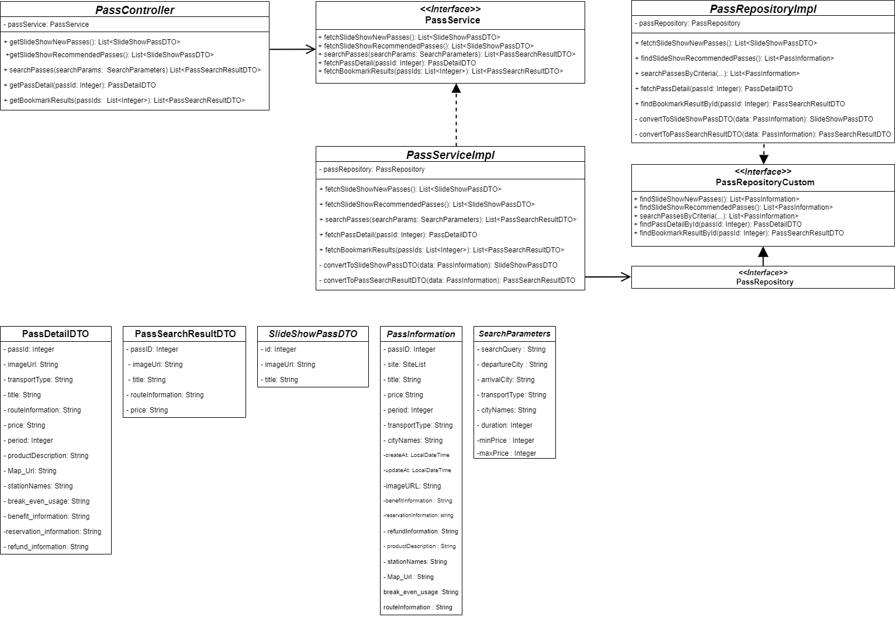
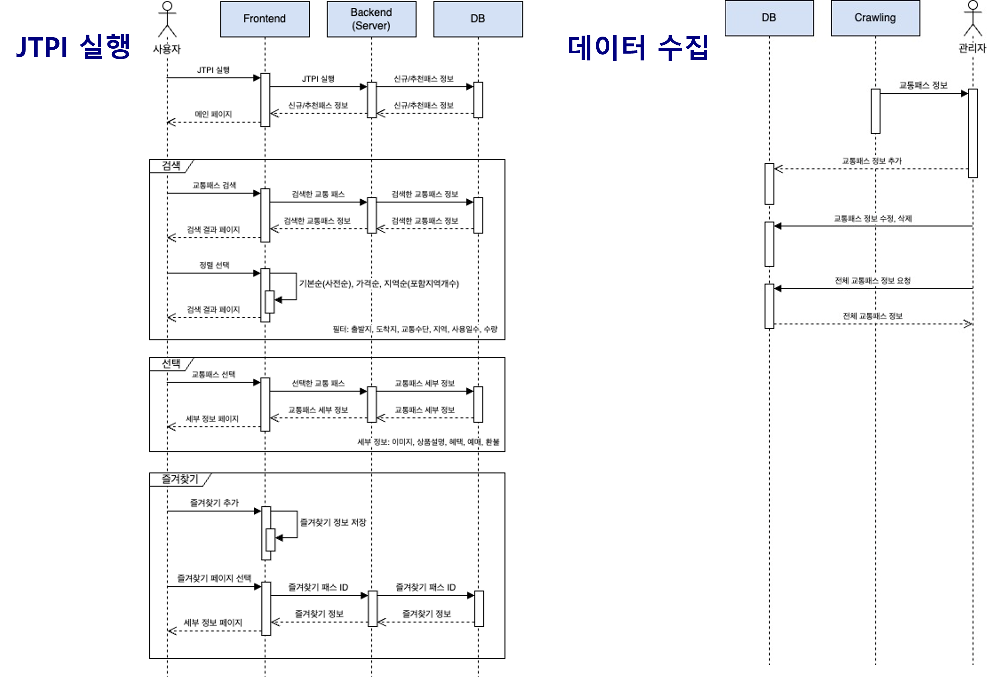

# 🚆 Japan Transportation Pass Information (JTPI) - Backend API

> **이 저장소는 [JTPI](https://github.com/Capstone-Project-4-1)의 백엔드 부분만 포크하여 관리하는 저장소입니다.**  
> **Spring Boot 기반으로 구현된 백엔드 API 코드가 포함되어 있으며, 프론트엔드는 포함되지 않습니다.**  

---

## 📌 기술 스택


---

## 📌 개발 배경 및 필요성




---

## 📌 구현 기능





---

## 📌 시스템 구성도


---

## 📌 ERD (데이터 모델)


---

## 📌 백엔드 클래스 다이어그


---

## 📌 API 시퀀스 다이어그램


---

## 📌 REST API 명세서  

### 📄 **SwaggerHub API 문서**  
🔗 **[JTPI API 명세서 - SwaggerHub](https://app.swaggerhub.com/apis-docs/janu-dd7/JTPI/1.0.0)**  

| 번호 | 기능 | 엔드포인트 | HTTP 메소드 | 설명 |
|----|----------------|-----------------------------|------------|-----------|
| 1  | 신규 슬라이드쇼 패스 | `/passes/slideshow/new` | GET | 최신 등록된 4개의 교통패스 반환 |
| 2  | 추천 슬라이드쇼 패스 | `/passes/slideshow/recommended` | GET | 추천된 교통패스 4개 반환 |
| 3  | 패스 검색 | `/passes/search` | POST | 조건 검색 결과 반환 |
| 4  | 패스 상세 정보 | `/passes/{passId}` | GET | 특정 패스의 상세 정보 반환 |
| 5  | 북마크된 패스 정보 | `/passes/bookmark` | POST | 북마크한 패스 목록 반환 |

---

## 📌 API 실행 방법  

1. **프로젝트 클론**  
   ```sh
   git clone https://github.com/MinGiAnnnngJin/jtpi_backend.git
   cd jtpi_backend
